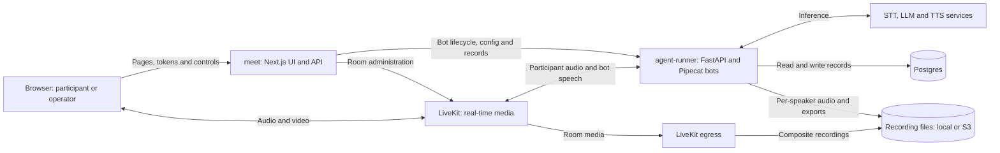
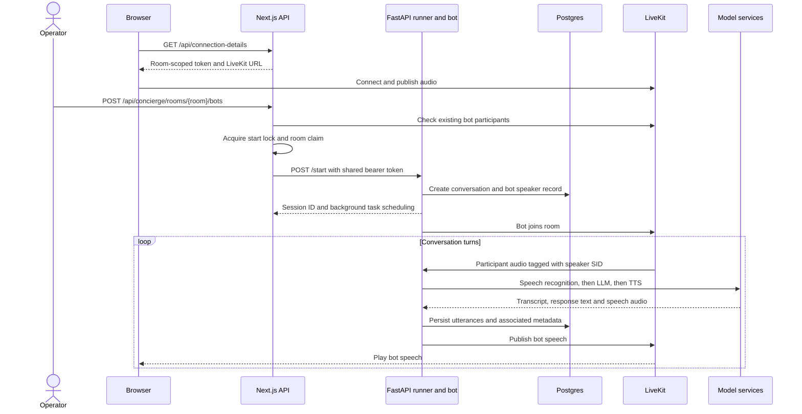
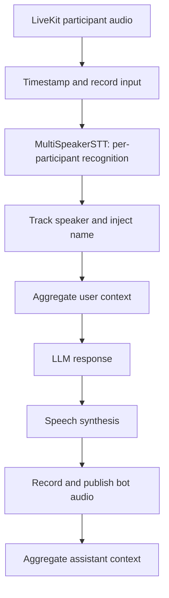
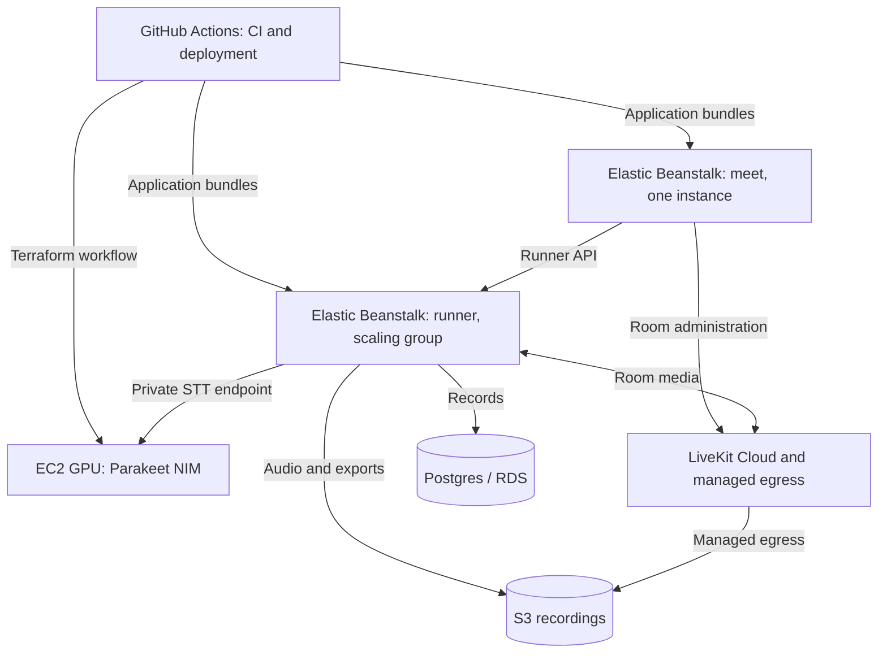
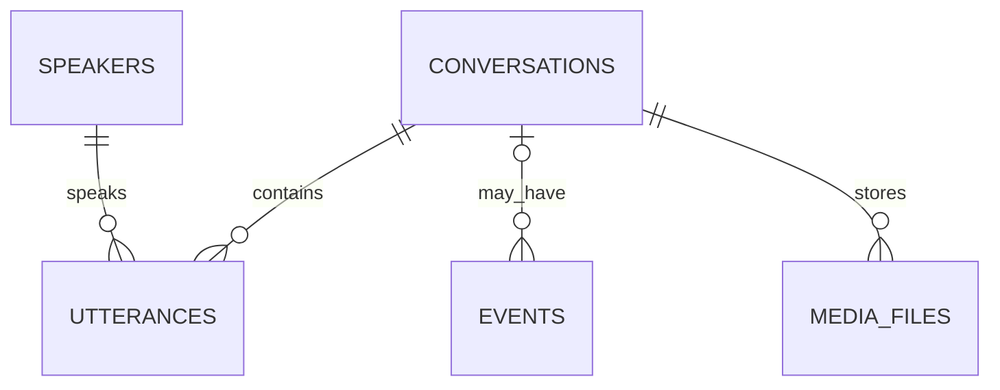

# MeetLab architecture

Reviewed against checkout `7bde204` on 2026-09-29. This is a map of the repository,
not an inspection of live AWS resources. Links into GitHub follow `main`, which
may move beyond this snapshot.

Use [C4](https://c4model.com/diagrams) to zoom from system boundaries into
services, sequence diagrams to explain behavior, and short decision records to
preserve the reasons behind a choice. A C4 container is an application or data
store; it does not necessarily mean a Docker container.

## System view

Participants join browser meetings. Researchers and operators configure bots,
manage rooms, and inspect recordings and transcripts. The web application
handles control requests; LiveKit carries real-time media.

STT means speech-to-text, LLM means language model, and TTS means text-to-speech.
Speech recognition can also run inside the runner, as it does with the local
Whisper override. The model box represents responsibilities, not one server.

| Code boundary | Responsibility | Read first |
| --- | --- | --- |
| `meet/app` | Browser pages and HTTP routes | [Participant token route](https://github.com/wwbp/MeetLab/blob/main/meet/app/api/connection-details/route.ts) |
| `meet/lib/concierge` | Room controls, bot start requests, process-local coordination | [Runner client](https://github.com/wwbp/MeetLab/blob/main/meet/lib/concierge/bot-runner.ts) |
| `agent-runner/runner.py` | API, bot launch, configuration, recording and record access | [Runner](https://github.com/wwbp/MeetLab/blob/main/agent-runner/runner.py) |
| `agent-runner/bot.py` | One meeting's audio pipeline and session lifecycle | [Bot](https://github.com/wwbp/MeetLab/blob/main/agent-runner/bot.py) |
| `agent-runner/db` | Persistent schema and configuration loading | [Models](https://github.com/wwbp/MeetLab/blob/main/agent-runner/db/models.py) |

## Runtime flow

This traces the operator's **Start Bot** path. Public start links have their own
provisioning route and reuse the runner client. Joining a room and starting a bot
are separate operations; the order below is one possible session.

The model exchange is simplified: recognition may be local, and text and audio
can stream. The returned session ID acknowledges scheduling, not bot readiness.
If the runner rejects a start, the web route releases the room claim.

### Inside a spoken turn

Read the `Pipeline(...)` in
[bot.py](https://github.com/wwbp/MeetLab/blob/main/agent-runner/bot.py) and
[multi_speaker_stt.py](https://github.com/wwbp/MeetLab/blob/main/agent-runner/multi_speaker_stt.py)
together. Speaker identity comes from individual LiveKit tracks.

The repository also contains `listener_factory.py`, `participant_pool.py`, and
`participant_router.py`. Those modules describe a worker-based direction, but
the reviewed `bot.py` pipeline uses `MultiSpeakerSTT`. File existence alone does
not establish that a component is wired into the running application.

## Infrastructure

### Local development

The source of truth is
[Docker Compose](https://github.com/wwbp/MeetLab/blob/main/.devcontainer/docker-compose.yml).

| Service | Local access | Purpose |
| --- | --- | --- |
| `meet` | `localhost:3000` | Web UI and API |
| `agent-runner` | `localhost:7860` | Bot runner API |
| `transport-server` | `7880–7882` | LiveKit signaling and media |
| `postgres` | Host `5433`, container `5432` | Persistent records |
| `redis` | `6379` | LiveKit/egress coordination |
| `egress` | No browser UI | Composite room recordings |
| `jaeger` | `localhost:16686` | Traces when tracing is enabled |
| `bastion` | Development container | Workspace access |

Local Compose defaults speech recognition to in-process `whisper-base` through
`STT_MODEL_OVERRIDE`. Recording files mount into the root `recordings/` directory.

### Production configuration

Application deployment is defined in
[cd.yml](https://github.com/wwbp/MeetLab/blob/main/.github/workflows/cd.yml).
The checked-in runner scaling defaults are 2–6 instances and can be overridden
by GitHub variables. The web tier is constrained to one instance by its
[scaling configuration](https://github.com/wwbp/MeetLab/blob/main/meet/.ebextensions/scaling.config).

[infra/stt-nim](https://github.com/wwbp/MeetLab/tree/main/infra/stt-nim) provisions
the GPU STT host, private DNS, and its security group. STT ingress is restricted
to the runner security group. Terraform here does not define the entire platform;
the RDS and managed-service details also rely on operational documentation.
Inspect the actual environment before treating these defaults as deployed facts.

## Data

The [schema](https://github.com/wwbp/MeetLab/blob/main/agent-runner/db/models.py)
also contains `bot_config`: configuration is selected by room scope, falling
back to `global`. Conversation rows represent a bot's join-to-leave session,
not every possible use of a room. Media rows describe files; the file bytes live
in local storage or S3. Events may exist without a conversation association.

## Design choices

These are summaries of rationale already recorded in source or repository docs,
not newly approved decisions.

| Choice | Reason | Consequence and evidence |
| --- | --- | --- |
| One web instance | Bot claims and start locks are process-local | Horizontal scaling requires shared coordination; [scaling notes](https://github.com/wwbp/MeetLab/blob/main/meet/.ebextensions/scaling.config) |
| Separate recognition per participant | Preserve speaker attribution from audio tracks | Recognition work grows with admitted participants; [STT router](https://github.com/wwbp/MeetLab/blob/main/agent-runner/multi_speaker_stt.py) |
| Refuse new recognition streams at capacity | Prior load tests showed silent response collapse | Refused participants cannot be heard by the bot; existing streams continue; [admission policy](https://github.com/wwbp/MeetLab/blob/main/agent-runner/participant_workers.py) |
| Durable event log | Keep diagnostic history across restarts | Writes should not break the operation; failed reads must be visible; [event logging](event-log.md) |
| Background bots inside runner instances | `/start` schedules the bot in the process serving the request | Session and some recording state are tied to that instance; [runner scaling notes](https://github.com/wwbp/MeetLab/blob/main/agent-runner/.ebextensions/scaling.config) |

For future changes, record **context, alternatives, decision, consequences, and
status** alongside the changed code. See [ADR guidance](https://docs.arc42.org/section-9/).
Use the [pilot postmortem](pilot-postmortem-2026-08.md) to learn the historical
failure modes, then check source and tests to see which still apply.

## Try one investigation

Follow one test meeting: locate its room name and conversation ID, inspect
[events](event-log.md), find its utterances and media records, then trace the
relevant code path above. Predict where a failure would appear if STT were slow
or the runner were unreachable. Use [performance tests](performance-tests.md)
when checking timing claims; a healthy HTTP endpoint alone does not establish
that a bot is hearing and replying.
