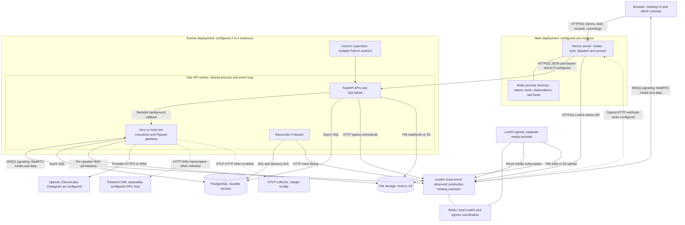
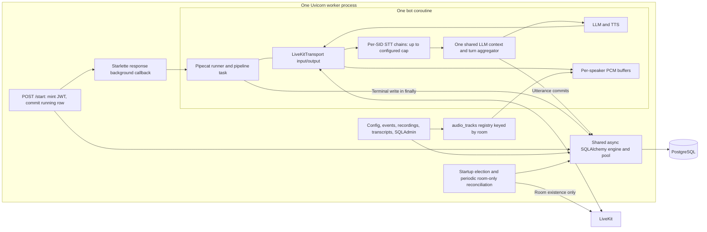

# Meeting application: current architecture and lifecycle diagnosis

Inspected 2026-09-29; final artifact and cleanup checks completed 2026-09-30 (America/New_York), commit `6d7cd2c3ec2ce1cdcf6ecb038cec7636e4e5da5a`. The working tree was clean before this investigation. Application source and deployment configuration were not changed. The accompanying probe created and removed temporary local database records and LiveKit rooms.

**After `/start` returns, the accepting FastAPI worker owns the bot.** Starlette awaits the async `bot()` callback after sending the HTTP response; the bot constructs its own Pipecat pipeline and runner inside that same OS process and event loop. Uvicorn retains the serving ASGI task, and Pipecat manages the pipeline's internal tasks. There is no application registry of bot execution handles, independently supervised bot process, persisted execution lease, or restart/resume dispatcher. The database row describes the session; it does not own execution. [E1, D1]

The working hypothesis is **partly supported**. Application APIs and bots share worker resources and fate. However, the web application is a separate deployment, the runner already supports multiple processes and instances, LiveKit carries browser media independently, and PostgreSQL persists meeting data. It is inaccurate to describe the whole system as one process or as an unmodified upstream development runner. Existing locks, reconciliation, and cancellation-safe writes are meaningful safeguards, albeit incomplete. [E1–E7]

The most consequential runtime discovery: **a bot joining a room with two existing silent humans ended when only one human left**. The inverse join order behaved correctly. Two direct starts also scheduled two sessions; removing a bot from LiveKit left its coroutine and database status running during the three-second observation. These are local observations, not claims about production incidents. [R1]

## Evidence conventions and scope

- **V — verified in code:** traced through application or the locally installed dependency, including stated configuration defaults.
- **O — observed at runtime:** executed during this investigation, with environment and test limits stated.
- **I — inferred:** predicted consequence of the verified implementation; not reproduced end to end.
- **U — unknown:** requires deployment state, browser testing, or an additional controlled experiment.

References `[E…]` identify repository evidence with symbols and line ranges in the evidence index. `[D…]` identify installed dependency source, not current upstream documentation. `[R1]` identifies the included local probe and its recorded results. Diagrams depict the current implementation; dashed edges identify optional or unverified deployed wiring. Proposed changes appear only in the improvement plan.

## 1. Component inventory and deployment boundaries

| Component | Responsibility and entrypoint | Process/container boundary | State owned | Dependencies and evidence |
|---|---|---|---|---|
| Browser meeting UI | Pre-join, token request, LiveKit room, microphone/camera, chat, completion screen and advisory timer; `PageClientImpl` | User browser; one `Room` per conference component | Connection, media tracks, React state; identity postfix is a server-set cookie | Next.js HTTP API and LiveKit signaling/media; E8, E9 |
| Browser console/start link | Admin room/bot controls; `ConciergeConsole`; public `StartClient.handleJoin` | Browser, separate from server routes | Loading/errors, polled health | `/api/concierge/**`, `/api/start-link`; E10, E11 |
| Next.js server | Console auth, room management, human JWTs, bot dispatch proxy, config/recording/download proxies, webhook ingress | `meet` deployment; local `pnpm dev`; Docker production `node server.js`; alternate Procfile `next start -p 8080` | Process-local claims, start locks, request history, presence/subscription observations and rate limits; events are forwarded to PostgreSQL | LiveKit server API, runner HTTP; no direct DB client in this path; E2, E4, E8–E13 |
| FastAPI API and administration | `/start`, configs, events, conversations, recordings, media files, transcript export, SQLAdmin | `agent-runner` deployment, Python/Uvicorn; one app and engine per worker | Worker-local DB pool, reconciler DB session, Python module registries | PostgreSQL, LiveKit admin API, storage; E1, E5, E14–E16 |
| Bot session | LiveKit participant; STT → shared conversation context → LLM → TTS; audio capture and utterance writes | **Coroutine inside the API worker**, not its own container/process | Context, SID maps, reply chain, STT chains, timing, audio buffers, Pipecat task handles | Pipecat, LiveKit RTC SDK, DB, models; E6, E17–E19 |
| Reconciler | Periodic closure of old `running` conversations whose room is absent | One elected FastAPI worker; startup-only election | PostgreSQL session advisory lock plus local untracked loop task | DB and LiveKit room listing; E5 |
| PostgreSQL | Durable research/application records | Separate service; local `postgres:17-alpine` container | Speakers, conversations, utterances, media references, events, bot config | Async SQLAlchemy/asyncpg; E14, E15 |
| LiveKit | Room membership, signaling, media/data transport and admin APIs | Separate local server; production hosting not established here | Live rooms, participant identities/SIDs, tracks | Local Redis; external clients and egress; E3, D2 |
| LiveKit egress | Composite room recording | Separate local egress container; optional managed egress path supported | Active recording job and output | LiveKit, Redis locally, local shared recordings directory or S3; E3, E16 |
| File storage | WAVs, composite recordings, Markdown transcripts | Local filesystem in development; S3 supported | File bytes; DB holds path/status | `storage.py`; E16, E20 |
| Parakeet NIM | HTTP transcription of segmented audio | Terraform defines one EC2 GPU instance running a systemd-managed container | Model/service process | Runner posts `/v1/audio/transcriptions`; E7, E19 |
| Other model services | OpenAI LLM; ElevenLabs/OpenAI TTS; optional OpenAI Realtime/Deepgram STT | External provider processes; local Whisper alternative executes in runner | Provider requests/streams; bot holds conversation context | Config-selected, API credentials by environment; E17, E19 |
| Telemetry | Turn traces, timing histograms, warning/error event log | Exporters in API worker; local Jaeger container; production collector unknown | DB events and configured external telemetry | OTLP HTTP; E21 |
| Participant worker helper modules | `ParticipantWorkerPool`, router, listener factory and responder-context utilities | Logical modules, **not additional running services** | Their own objects only if instantiated | No production import path from `bot()` found for these helpers. `MultiSpeakerSTT` does use `participant_workers.route_audio`; E18 |

**V — configured deployment:** CD packages Meet and runner separately and deploys to separate Elastic Beanstalk environment names. Runner source specifies 2–6 `c6i.xlarge` instances; CD applies overridable bounds/type. Meet source specifies exactly one `c6i.large` instance. Runner worker count is `AGENT_RUNNER_WORKERS` when valid, otherwise `max(2, os.cpu_count())`. Four workers per nominal four-vCPU runner instance is a conditional inference, not an observed production count. EB direct settings can override bundle settings. [E2, E4]

**O — local deployment:** Docker reported one Meet container, one runner container, LiveKit `v1.12.0`, egress `v1.13.0`, PostgreSQL 17, Redis 7, Jaeger 1.65 and a bastion. The runner reported 12 CPUs, no worker override and a configured worker count of 12; `/proc` contained 15 Python processes including the inspection process. This establishes multiple Python processes, not an exact PID-to-role census. LiveKit destination was the Compose transport server, storage was local, and runner bearer authentication was disabled locally. There were zero active rooms/participants before the probes.

**U — production:** actual deployed commit, running workers/replicas, EB platform choice for Meet (Docker versus Procfile), load-balancer routing/stickiness, termination grace and scale-in behavior, PostgreSQL hosting/HA, actual storage backend, LiveKit Cloud versus self-hosted, webhook registration and telemetry exporter health. Terraform/CD establish intended resources and delivery paths, not successful deployment. No cloud account inspection was performed. Read only the relevant nonsecret environment settings, deployment version labels, process inventory, LB deregistration settings and LiveKit project configuration to settle these questions.

### Dependency and provenance baseline

| Dependency | Lockfile/resolution | Locally installed verification |
|---|---|---|
| Pipecat | `pipecat-ai` 1.4.0; manifest allows `>=1.4.0,<2.0.0` | Host virtualenv and runner container both 1.4.0 |
| Python LiveKit | `livekit` 1.1.7; `livekit-api` 1.1.0; protocol 1.1.7 | Host metadata matches; container RTC package 1.1.7 |
| FastAPI / Starlette / Uvicorn | 0.136.1 / 1.3.1 / 0.46.0 | Host metadata matches; container FastAPI/Uvicorn match |
| SQLAlchemy / asyncpg | 2.0.49 / 0.31.0 | Lockfile inspected |
| Next / React | 16.3.3 / 19.2.7 | Host `node_modules` matches |
| Browser LiveKit / server SDK | 2.17.1 / 2.15.5 | Host `node_modules` matches |
| LiveKit React components | 2.9.19 | Host `node_modules` matches |
| Media server / egress | Compose image tags 1.12.0 / 1.13.0 | Running local Docker images match |

Sources: `agent-runner/pyproject.toml:6–23`, `agent-runner/uv.lock`, `meet/package.json:5–43`, `meet/pnpm-lock.yaml`, installed package metadata and local Docker inventory. Runner Dockerfile uses Python 3.12, while the active local container virtualenv reported Python 3.11.16 and the host virtualenv 3.11.15; the mounted/reused virtualenv is therefore relevant to reproducibility. Frozen dependency installation in Docker does not establish what an already-running mounted environment contains.

Meet is vendored regular source from `livekit-examples/meet`, commit `3a75f3222f13f267bb19613a9311f98a5acc51f5`, according to `meet/VENDORED_FROM.md:1–6`. Current runner code imports the local `LiveKitRunnerArguments` dataclass, not `pipecat.runner.run`. Its initial historical derivation from upstream cannot be established just from similar `/start` naming. `PipelineRunner` and `PipelineTask` are deprecated compatibility names for Pipecat's internal worker execution APIs in installed 1.4.0; renaming them would not introduce a fleet dispatcher. [E1, D3]

## 2. Current architecture diagrams

The first view uses C4-style application/service boundaries. The EB labels describe checked-in configuration; local equivalents and production uncertainties are stated above.



Inside a FastAPI worker, all boxes below share the same Python process; multiple bots repeat the session box. The shared event loop, database pool and resource limits form the relevant failure boundary. [E1, E5, E17–E21]



## 3. Join, dispatch and authorization

**V — admin path:** `ConciergeConsole.handleCreateRoom` calls `POST /api/concierge/rooms`, then optionally the room's `/bots` route; the separate Start Bot action calls the same `/bots` handler. The room API uses LiveKit `createRoom`. There is no durable standalone meeting row at this point. The bot start later creates `Conversation`. [E10, E12]

**V — public start-link path:** a console user signs a token containing a pool of config scopes. `StartClient.handleJoin` POSTs it; the server validates its purpose/signature, rate-limits, randomly selects a config, copies it to a new room scope, creates the room, calls the runner, records a local claim, and returns a room URL. Each submission intentionally creates a fresh room; there is no request idempotency key. Config copy, room creation and launch are separate operations without compensation. [E11]

**V — human join:** pre-join submission fetches `/api/connection-details`; Next mints a five-minute room-scoped participant JWT and concurrently fetches the session limit from the runner, with a two-second fallback to zero. The browser then connects directly to LiveKit. Joining or refreshing a `/rooms/...` page does not dispatch a bot. [E8, E9]

**V — trust boundaries:** console middleware checks a signed cookie with `sub === 'console'` for concierge/config/meeting-data routes. Public start links check their own purpose but have no expiry. Runner HTTP routes check a shared bearer secret **only if `BOT_RUNNER_SECRET` is set**. Human token issuance checks origin when present and limits requests per IP, but does not verify room membership, an invite, or a signed start link. `/api/record/start` and `/stop` are public GET routes that forward privileged recording commands for a supplied room name. Knowing a room name is sufficient at these endpoints; IP throttling and origin checks do not establish meeting membership. [E8, E11, E13]

**V — bot credentials:** runner `_create_bot_token` signs a token for one room with publish/subscribe/data and agent grants, default TTL 15 minutes. Optional `agentName` is copied into LiveKit room agent-dispatch configuration as well as starting the local bot; no external named-agent deployment was established. Token TTL is a credential lifetime, not a demonstrated session timer—comments suggesting a fixed disconnection at JWT expiry are not runtime evidence. [E1]

```mermaid
sequenceDiagram
  participant browser as Browser
  participant next as Next.js routes
  participant lk as LiveKit
  participant api as FastAPI worker
  participant db as PostgreSQL
  participant bot as Bot coroutine in same worker
  browser->>next: Admin create room, or POST signed start link
  next->>lk: createRoom
  next->>api: POST /start with room and bot identity
  api->>api: Mint room-scoped bot JWT
  api->>db: Commit Speaker and Conversation status=running
  api-->>next: 200 session_id and Bot is joining room
  api->>bot: Execute response background callback
  next-->>browser: Start requested / room URL
  bot->>db: Load room or global config
  bot->>lk: Connect and publish bot audio/avatar
  browser->>next: GET /api/connection-details
  next->>api: GET /config, at most 2 seconds
  next-->>browser: Human JWT, LiveKit URL, advisory limit
  browser->>lk: Connect; publish microphone/camera
  next->>lk: Console polls participants and track count
  next-->>browser: starting / connected_no_tracks / connected / missing
```

There is no implemented application acknowledgement of pipeline readiness. `running` is written before setup, the runner's 200 means a background callback was scheduled, and concierge `started` means the runner request succeeded. `connected` means a bot-looking participant has at least one published track—possibly an avatar—not that transcription or models work. [E1, E10, E22]

```mermaid
sequenceDiagram
  participant a as Caller A
  participant b as Caller B or retry
  participant next as Next.js process
  participant api as Runner workers
  participant db as PostgreSQL
  a->>next: POST room bots
  next->>next: Check LiveKit presence; acquire local lock and claim
  next->>api: POST /start
  b->>next: Same-process concurrent start
  next-->>b: 409 while lock or claim exists
  api->>db: New running Conversation
  api-->>next: 200 accepted for background execution
  next-->>a: started
  alt Another Next process or direct runner caller
    b->>api: POST /start for same room
    api->>db: Another UUID Conversation; no room uniqueness guard
    api-->>b: Another scheduled bot
  else Request timeout after ambiguous launch
    next->>next: Release claim on runner-call failure
    b->>next: Retry
    next->>api: New start if no visible bot yet
    api->>db: New session, no idempotency lookup
  end
```

Same-process synchronous claim/lock mutations close the normal concurrent concierge race. They do not close another process's race, a direct runner call, or an ambiguous timeout. A successful claim can survive failed bot setup for up to 40 minutes if no applicable webhook arrives. A stale `participant_left` event for any `bot_` identity can clear a newer claim because the webhook cleanup accepts the prefix as well as exact identity. No webhook dispatch path starts bots. [E10, E23]

## 4. Actual lifecycle, failures and shutdown

There is no explicit application execution state machine. These states are reconstructed from the code; `setup`, `joined`, `active` and `disconnected` below are conceptual execution phases sharing the same persisted `running` value. [E1, E5, E6, D2–D4]

```mermaid
stateDiagram-v2
  [*] --> committed: start commits Conversation.running
  committed --> setup: response background callback runs
  committed --> stale: worker dies or callback never starts
  setup --> joined: config and pipeline setup; LiveKit connect
  setup --> stale: exception before lifecycle try/finally
  joined --> active: participant speech or data
  active --> active: advisory limit announces closing only
  joined --> completed: tracked participant map empties
  active --> completed: tracked participant map empties
  joined --> completed: inherited pipeline idle timeout
  active --> completed: inherited pipeline idle timeout
  active --> disconnected: bot removed or transport lost
  disconnected --> completed: later idle/cancel completion
  disconnected --> stale: process dies before cleanup
  active --> error: exception propagates through runner.run
  active --> completed: runner.run returns normally or cancellation is handled
  active --> stale: hard process death
  stale --> ended: age threshold plus missing LiveKit room
  stale --> stale: room still exists or reconciler unavailable
  completed --> [*]
  error --> [*]
  ended --> [*]
```



**V/O — departure policy:** `on_participant_disconnected` flushes that SID, removes its STT chain and cache entry, and cancels the whole pipeline if `_sid_to_identity` is empty. With the bot joining first, the local probe confirmed that one of two departures preserves the bot, while the last departure ends it. With humans already present, installed transport `connect()` calls only the first-participant hook; it does not populate this app's per-participant cache for the initial roster. Silent participants do not trigger the speech/data recovery paths. The local probe confirmed early termination on the first departure. The cache is also not filtered to humans; another bot or service participant can affect emptiness. [E6, E17, D2, R1]

**V/O/I — refresh and temporary loss:** no application empty-room grace period exists. After an actual last-human disconnect, a later human rejoin did not restore the bot in the local probe. Browser refresh itself was not exercised; whether a short outage produces a disconnect event depends on LiveKit reconnect timing. Once it does, this application has no resume action, persisted context reload, or automatic replacement. The browser's initial connectivity fallback remounts with TURN-only options, separate from bot dispatch. [E9, R1]

**V/O — explicit stop:** console Stop Bot removes the LiveKit participant and releases the Next claim; it does not contact a runner stop endpoint. The app registers no `on_disconnected` handler. Installed transport's callback only emits the event; it does not itself cancel the task. The probe observed the removed bot's callback still pending and its row still `running` after three seconds. The inherited idle timer can eventually stop it; this is not immediate execution termination. [E12, D2, R1]

**V — timers:** Pipecat 1.4.0 defaults to a 300-second idle timeout, based on selected speaking frames, with cancellation enabled. The app leaves those defaults in place. Raw audio is not by itself proof that this timer resets: the multi-speaker collector drops some VAD frames. The study limit is a separate advisory timer; it queues a closing utterance and does not disconnect anyone. Pipeline heartbeat monitoring defaults off and no durable bot heartbeat is written. [E6, E18, D4]

**V — terminal writes:** only `runner.run(task)` is inside the lifecycle `try/finally`; transport/config/model/pipeline construction occurs earlier. `_finalize_conversation` shields its update and, if cancelled, waits for that update before re-raising. A setup-failure injection produced zero finalizer calls. Normal return and cancellation are both labeled `completed`; propagated exceptions are labeled `error`. Therefore `completed` is not proof of a successful meeting, and `running` is not proof of execution. Dependency-internal error handling may not propagate every pipeline error to this outer block. [E6, D3, R1]

```mermaid
sequenceDiagram
  participant api as API worker with bots
  participant bot as Bot callback
  participant db as PostgreSQL
  participant lk as LiveKit
  participant replacement as New API worker
  participant sweep as Elected reconciler
  alt Error reaches lifecycle try/finally
    bot->>db: Flush remaining audio and write terminal status
  else Setup fails before try/finally
    bot->>bot: Callback raises; no terminal write
  else Worker is killed
    api->>api: Process ends; all hosted callbacks and context lost
  end
  replacement->>replacement: Start HTTP service and try reconciler election
  replacement->>replacement: No session resume or redispatch code
  sweep->>db: Read old running conversations
  sweep->>lk: List room names
  alt Room absent
    sweep->>db: status=ended and ended_at
  else Human keeps room alive, or room name reused
    sweep->>sweep: Leave row running; bot presence not inspected
  end
```

**V/I — reconciliation limits:** one DB advisory lock coordinates initial election across workers and instances. Losing candidates return permanently; they do not retry election. If the leader dies, PostgreSQL can free the lock, but surviving workers do not automatically contest it. If the leader's DB connection breaks, its loop does not validate/reacquire leadership. This is weaker than the source comment claiming automatic role transfer. The reconciler checks room names, not bot identity/process/heartbeat; the probe kept two never-started sessions `running` while a human kept their room alive. Its terminal UPDATE does not recheck `status='running'`, so a concurrent normal finalizer can also race with the sweep. [E5, R1]

```mermaid
sequenceDiagram
  participant user as Participant or admin
  participant next as Next.js
  participant lk as LiveKit
  participant bot as Bot in API worker
  participant db as PostgreSQL
  participant platform as Deployment platform
  alt Participant leaves
    user->>lk: Disconnect
    lk->>bot: on_participant_disconnected
    bot->>bot: Flush SID; remove STT and cached identity
    opt Cached roster is empty
      bot->>bot: task.cancel
      bot->>db: Flush audio and finalize completed
    end
  else Admin ends room or removes bot
    user->>next: DELETE room or bot
    next->>lk: deleteRoom or removeParticipant
    next->>next: Release local claim
    lk->>bot: Transport disconnect event
    bot->>bot: No application disconnect-to-cancel handler
  else Runner deployment or scale-in
    platform->>bot: Worker or container termination
    bot->>bot: Uvicorn can wait on ASGI background work if signal reaches it
    opt Callback reaches its finalizer before process exit
      bot->>db: Terminal write and buffered audio persistence
    end
    platform->>platform: Actual signal forwarding and grace deadline unknown
  end
```

**V/I/U — deployment drain:** Uvicorn's installed shutdown path stops accepts and waits for ASGI background tasks; it can cancel them at its configured graceful deadline. This app sets neither a deadline nor an application draining flag/readiness check. Each bot constructs `PipelineRunner()` with default SIGINT handling, potentially replacing the loop's SIGINT handler with that bot's handler. SIGTERM handling is off in that Pipecat runner by default. The Docker command starts through `sh -c` and `uv`; exact forwarding and platform kill timing require a controlled deployment test. EB rolling deployment `Timeout: 1800` and LB `IdleTimeout: 3600` do **not** implement a bot-aware application drain. A completed `/start` HTTP request is not a load-balancer representation of the ongoing LiveKit session. [E2, D1, D3, D5]

**V/I — cleanup:** Pipecat owns pipeline task cleanup and transport disconnect on normal cancellation. `MultiSpeakerSTT` sends end/cancel frames and stops its pump; individual removal sends EndFrame. App audio flushing and final DB writes have shielding, but `_bg_tasks` (auto-record and closing timer), avatar frame tasks and rolling audio-write tasks have no unified app-level cancel-and-await phase. A closing timer can outlive its pipeline. No application shutdown hook disposes the engine or explicitly closes the held reconciler session. Process death loses in-memory context and unflushed PCM regardless of shielding. These are resource-lifecycle risks, not measured leak rates. [E5, E6, E18, E20]

## 5. Identity, persistent state and coordination

| Identifier/state | Creation and stability | Authority and limitation |
|---|---|---|
| Human identity / `Speaker.id` | `participantName__randomPostfix`; four-character postfix in a two-hour cookie | Stable only while cookie/name persist; shared across rooms in the speaker table. Not an authenticated account ID. |
| Prolific ID | Client-supplied metadata, validated in UI and captured by bot | `Speaker.meta`; useful study identity, not authorization. |
| LiveKit room name | Admin-selected or new random start-link room | LiveKit owns live room existence. Reuse of a name is not distinguished by the reconciler. |
| Room SID / participant SID | LiveKit-assigned connection/resource identifiers | The bot maps participant SID to identity. Installed transport passes SIDs for normal callbacks; fresh joins need fresh mappings. Exact reconnect SID behavior depends on SDK reconnect path. |
| Meeting ID | UI `/api/meetings` exposes `Conversation.id` | A bot-session record, not a separate durable meeting aggregate; multiple sessions can share a room name. |
| Bot identity | Usually `bot_<room-slug>_<random>` per request; caller may supply it | LiveKit identity plus DB field. Repeating a supplied identity still creates a new Conversation; room-level duplicate-identity effects are not an application lease. |
| Session ID | UUID in runner `/start`, also `Conversation.id` and Pipecat `conversation_id` | Stable within that execution. A retry creates another ID. |
| Concierge request ID | Locally generated request-history ID, created after runner response | Not passed as a runner idempotency key; history disappears with the Node process. |
| Execution attempt / owner / heartbeat | None in schema | No durable PID/worker ID, lease generation, fencing token, restart count or last-heartbeat timestamp. |
| Conversation context | `LLMContext` initialized with system prompt | In bot memory. Persisted utterances are not replayed on restart. |
| Utterances | UUID per turn, FK to conversation/speaker, reply-to chain | PostgreSQL is durable record authority. No provider-event deduplication key. |
| Recording/transcript/audio references | `MediaFile` with pending/available/failed, path and JSON metadata | DB indexes bytes in filesystem/S3; those writes are not one transaction. |
| Custom settings/study state | `BotConfig.scope` unique; room scope overrides global; session `meta` stores caller data | Bot reads config at startup. Browser independently reads current config; runtime config is not a complete immutable session snapshot. Completion code is derived, not stored. |

Evidence: E1, E8, E11, E14–E17, E20, E24.

**V/I — consistency windows:** DB commit precedes launch scheduling. If import/setup or the worker fails after commit, the row remains `running`; if a response is lost after scheduling, a retry cannot identify the previous attempt. No transaction can cover the current DB → in-memory callback handoff. For recordings, LiveKit egress starts before the MediaFile commit, so a DB failure can leave a recording with no matching row. File bytes are written before transcript/WAV metadata commits, so DB failure can orphan files. [E1, E16, E20]

**V — event idempotency:** `Speaker` upserts and updates to an existing recording provide some duplicate tolerance. However, events are append-only without source-event uniqueness; the webhook route both calls `pushConciergeEvent` (deferred durable write) and separately POSTs to runner `/events`, so one webhook can yield two event rows even without redelivery. Forwarding has no durable retry/acknowledgement chain. `_handle_egress_event` only updates a row read as `pending`, but read/update are separate transactions and it treats status 2 (`ENDING`) as available, possibly before upload finishes. Concurrent transcript requests can both pass the exists check because no `(conversation,type)` uniqueness or claim is enforced. [E13, E16, E20, E21]

## 6. Media, messaging and group conversation

**V — paths:** browser and bot each connect directly to LiveKit using SDK signaling over WS/WSS and WebRTC media/data. FastAPI is a media endpoint for the bot's PCM processing, not an HTTP/WebSocket proxy for human browser media. The HTTP application paths carry control/config, events, file downloads and recording commands. NIM receives WAV segments over HTTP; external streaming providers use their respective HTTP/WebSocket clients. LiveKit sends signed HTTP webhooks to Next when configured; Next forwards normalized events to FastAPI. No application-defined browser-to-FastAPI WebSocket endpoint was found. Local Redis serves LiveKit/egress, not a bot work queue. [E3, E8–E13, E17, E19]

**V/I — client ownership:** the browser uses LiveKit's React `VideoConference` and one app-created Room; no Pipecat browser client dependency or second Pipecat media connection is present. Pre-join may preview local devices. The connection effect cleanup removes event listeners but does not explicitly disconnect the Room. A TURN fallback remount creates a new Room, so checking whether an old partially connected Room/tracks survive that remount is warranted; duplicate publication is not established by static inspection. [E9]

**V/I — chat and data contract:** the installed LiveKit React chat implementation sends a modern text stream (`sendText`) **and a companion legacy data packet** containing `message`, numeric millisecond `timestamp`, ID and `ignoreLegacy`. The bot consumes `data_received` bytes as JSON, reads `message`/`timestamp`, and ignores the other fields, including `ignoreLegacy`. This provides a code-backed browser-chat route through the companion packet even though no text-stream handler is registered. Tests injecting `publish_data` do not verify the complete browser path. The bot handler lacks a version, message ID dedupe, acknowledgement, topic gate and structural/type validation after `json.loads`. Sender SID comes from LiveKit, but any participant allowed to publish data can inject an interruption and text; there is no addressed-to-bot or role check. Valid non-object JSON fails on `.get`; the numeric browser timestamp is also inconsistent with the ISO-string assumption in `_iso_to_unix`. These need contract checks, not an assumption that modern chat is disconnected from the bot. [E17, D2, D6]

**V — RTVI nuance:** although the app does not wire an RTVI client or readiness handshake, installed `PipelineTask` automatically enables an RTVI processor and observer unless disabled. It is therefore wrong to conclude that no RTVI exists from an app-only symbol search. Its implicit bot-ready mechanism is not consumed as the UI's lifecycle authority. Current online LiveKit transport documentation also differs from installed code on callback identity naming; this report uses inspected 1.4.0 SID behavior. [D2, D4]

**V/I — speaker attribution:** incoming audio frames carry SID; `MultiSpeakerSTT` creates a chain per SID, label injection prefixes display names, and the bot recovers missing identity mappings from the live roster when a turn is committed. This is materially better than mixed-audio attribution. However, all chains merge into one output queue and user aggregator, with one mutable current-speaker cell and one reply-to chain. If overlapping results merge into one turn, one `Utterance.speaker_id` cannot describe every speaker in that text. The fallback to the first cached participant can misattribute an unresolved SID. Simultaneous-audio attribution was not measured in this investigation. [E17, E18]

**V — addressing, interruption and echo:** admitted speech goes to the shared LLM context without a deterministic “was the bot addressed?” gate; any restraint relies on the configured prompt. Any admitted human speech onset may trigger the custom interruption handler, subject to its floor/timing policy; data messages interrupt unconditionally. LiveKit subscribes remote tracks, so the bot's own local output is not directly looped into its input. Acoustic recapture via a human microphone remains possible; the self-echo comparison logs/flags suspicious text but does not suppress it. Other bots are remote participants and are not excluded by a bot-kind gate. [E17–E19, D2]

## 7. Capacity, shared failures and observability

**V — admission:** `/start` has no session-count limit, memory budget, capacity reservation, queue, or busy response. More API processes and EB autoscaling distribute requests, but do not allocate by active bot load or migrate ongoing bots. `MAX_PARTICIPANT_WORKERS` defaults to six and is actually enforced by `MultiSpeakerSTT` **per bot/room**, based on its own STT dictionary—not per runner process despite the policy module's introductory wording. Excess new audio is dropped, warning/counter emitted, but the participant still joins the room and gets no explicit client refusal. Existing admitted streams are preserved. There is no bound on the number of six-participant rooms one worker can accept. [E1, E2, E18, E21]

**V/I — resource sharing:** one worker shares an event loop, DB engine/pool and memory among APIs, bots, recording/transcript work and event logging. Independent workers improve process isolation but each still hosts several sessions, while all may share PostgreSQL, NIM and provider quotas. CPU-heavy VAD/model setup, WAV encoding, synchronous local file I/O and ZIP creation can occupy the API event loop. S3 read/upload already use an executor and NIM uses async HTTP; there is no evidence here that every model request blocks the loop. Per-speaker audio buffers roll at 128 MiB by default, but multiply across speakers/sessions; the merged STT queue is unbounded. No current throughput ceiling is established by this audit. Historical benchmark claims in comments are not fresh measurements. [E18–E21]

**V — existing diagnosis:** OpenTelemetry records STT delay, post-STT response delay, LLM TTFT, sentence aggregation, TTS TTFB, utterance count, queue depth, suspected echo, phantom speech, interruptions and refused participants. Tracing is optional and includes conversation ID, room and bot attributes. Utterance JSON stores timing; DB events record admin actions and mirrored warnings/errors. Console health polls LiveKit rather than relying entirely on the Conversation status. [E21, E22]

**V/I — missing diagnosis:** no explicit request-to-pipeline-ready measurement, active-execution gauge, unexpected-exit counter, per-attempt heartbeat or per-meeting resource usage. A request ID is generated after dispatch rather than propagated through it. The Python event sink only extracts `room_name`/`conv_id` from structured log extras, while many bot log calls interpolate identifiers into strings, so filtering by room can miss warnings. `/health` returns static success without checking model, DB, admission or draining state. More logging is not a substitute for an authoritative lifecycle record. [E1, E21, E22]

## 8. Findings ranked by impact

Severity: **High** can end a meeting, lose capture, allow unauthorized room actions or prevent recovery; **Medium** causes misleading state, operational fragility or race-dependent data problems. Confidence refers to the finding under its stated trigger, not its prevalence in production.

| ID / kind | Evidence and trigger | User-visible consequence | Severity / confidence | Smallest useful fix |
|---|---|---|---|---|
| F1 Confirmed defect, V/O | Bot joins after silent humans; cached roster empty/incomplete; first human departs. E6, D2, R1 | Bot leaves while another human remains; row says completed. Reproduced twice. | High / high | Initialize identities from live roster on connect and decide departure from current non-bot roster, excluding departing SID; add short reconnect grace. |
| F2 Confirmed defect, V/O | Admin removes bot; no bot transport-disconnect handler. E12, D2, R1 | Bot disappears but execution/resources and running status persist until another termination path. | High / high | Handle own disconnect by cancelling that session and awaiting finalization; return stopped only once acknowledged. |
| F3 Confirmed gap, V/O; race risk I | Two direct `/start` calls; or separate Next processes/ambiguous timeout. E1, E10, R1 | Multiple sessions can be accepted for the same room; duplicate bots/cost/conflicting capture possible. | High / high for direct acceptance; medium for deployed race frequency | Put idempotency and one-active-session reservation in runner/Postgres. Keep single Meet process until proven across replicas. |
| F4 Confirmed defect, V/O | Setup fails before `runner.run` try/finally. E6, R1 | Start reports success while bot never becomes usable; running row and claim linger. | High / high | Wrap complete bot setup in lifecycle boundary; record starting/failed and expose readiness/failure. |
| F5 Confirmed gap, V/O | Bot absent but human/another bot keeps room alive; room-only reconciliation. E5, R1 | Dead sessions remain running; conversation/console disagree. | High / high | Compare expected bot identity and execution heartbeat with a startup/reconnect grace; conditional terminal updates. |
| F6 Confirmed code defect, V/I | Elected reconciler dies, or startup DB unavailable; losers never retry. E5 | Background recovery can stop until another worker starts. | Medium / high code confidence; failover not exercised | Periodically retry election and verify held connection; use explicit lifespan cleanup. |
| F7 Confirmed code defect, V/I | Manual recording reaches a different worker from the bot. E16, E20 | Composite recording may start while per-speaker WAV capture silently does not. | High / high | Persist recording intent and have the owning bot observe/acknowledge it; immediate workaround is in-bot auto-record. |
| F8 Design risk, V/I/U | Worker crash, rollout or scale-in while sessions active. E1, E2, D1, D3, D5 | Every bot in that worker is at risk; no resume or guaranteed drain; latest context/PCM can be lost. | High / high shared fate; actual shutdown timing unknown | Explicit task ownership, drain/readiness, one signal owner and bounded cleanup; consider process isolation after measurement. |
| F9 Capacity gap, V/I | Many rooms; or seventh active transcribed participant in one room. E18, E21 | Shared-worker overload; excess participant remains visible but unheard by bot. | High / high code confidence | Measured per-worker admission before accepting start; surface per-room refusals and active-session metrics. |
| F10 Confirmed authorization gap, V | Public token route and recording GET proxies lack room capability/membership check. E8, E13 | Caller with room name can obtain a participant token or start/stop its recording. External exposure not tested. | High / high code confidence | Validate signed room capability; make recording mutation POST with room authorization; require runner secret in deployed mode. |
| F11 Design/data risk, V/I | Overlapping speakers merge into shared turn, or unresolved SID falls back to another participant. E17, E18 | Stored speaker/reply attribution may not represent actual speech. | Medium / medium pending audio reproduction | Preserve SID per committed transcript item; do not silently label unknown group speech as first participant. |
| F12 Confirmed code/data gap, V/I | Duplicate webhook forwarding/redelivery; concurrent transcript start; egress ENDING event. E13, E16, E20 | Duplicate event/export rows; downloads advertised before recording is complete. | Medium / high code confidence | One durable event ingress with source ID uniqueness; atomic export claim; mark available only at confirmed completion. |
| F13 Contract gap, V/I | Untyped raw data handler; numeric browser timestamp versus ISO assumption. E17, D6 | Malformed data can fail handler or interrupt bot; chat timestamps can be lost. Browser sends a compatible legacy companion packet, but end-to-end delivery remains untested. | Medium / high validation gap | Validate message/type/topic and timestamp format; deduplicate by message ID; test actual browser chat. |
| F14 Cleanup risk, V/I | Session ends while closing timer, auto-record, avatar or rolling writes remain pending. E6, E20 | Work can outlive session; write/termination races. | Medium / high code confidence; duration unmeasured | Collect session-owned tasks, cancel/await them in one finally with a deadline. |

These findings do not justify Kubernetes, a queue or a framework rewrite by themselves. The confirmed defects are at ownership, presence and transaction boundaries and can first be corrected within the existing two application deployments.

## 9. Incremental improvement plan — proposed, not current behavior

**First boundary to strengthen: session execution ownership inside the runner.** Make acceptance, readiness, cancellation and finalization part of one runner-owned contract. Fix the observed presence/disconnect bugs within that work; moving the same code into another service would preserve them.

| Step | Behavior change and scope | Verification | Rollback |
|---|---|---|---|
| 1. Correct session termination | Use live human roster plus reconnect grace; register own-disconnect handling; wrap all setup and await owned background tasks. Keep current transport and deployments. | Both join orders, one of two humans leaving, last-human refresh, explicit removal, setup failure; assert both task termination and DB state. | Revert code; no destructive migration. Retain the new regression checks to explain restored risk. |
| 2. Make dispatch idempotent and state honest | Runner transaction reserves room/session using existing PostgreSQL; request key returns same session on retry; status starts as starting and advances on explicit readiness. Store owner and attempt generation. DB uniqueness must cover concurrent workers; a short advisory lock alone is insufficient after it is released. | Two starts via two API workers and two Next processes; dropped start response; failure between reservation and task creation. Exactly one active attempt; no claim permanently stuck. | Additive fields first; keep old response fields. Disable new dispatch path before rolling back code; remove constraints only after active sessions drain. |
| 3. Reconcile ownership and route commands | Retrying leader election; heartbeat/presence reconciliation using expected bot identity; compare-and-set terminal writes; recording intent consumed by owner. Do not auto-replace before the old attempt is fenced/stopped. | Kill leader and execution owner independently; keep human in room; route recording to another worker; late old-attempt finalizer cannot overwrite replacement state. | Disable automatic recovery/command polling; retain durable records; fall back to manual start and auto-record while triaging. |
| 4. Bound capacity and drain | Task registry per worker, measured concurrent-session limit, busy response with retry guidance, readiness=false while draining; Uvicorn owns process signals. Set platform grace based on measured teardown/session policy. | Low test cap rejects extra starts while existing bots respond; isolated worker SIGTERM and active-session rollout; observe bounded cleanup and buffered-write completion. | Restore prior limits/readiness behavior by config; preserve visibility into accepted sessions. Never reduce replicas underneath untracked sessions as rollback. |
| 5. Tighten participant contract and persistence | Room capabilities for token/recording APIs; shared text schema; durable event IDs/export claims; speaker-attributed transcript events. | Unauthorized cross-room requests rejected; actual browser chat reaches correct bot once; replayed events do not duplicate outputs; overlapping audio attribution checked. | Deploy compatibility window for capabilities/message version; retain old readers of additive fields. |
| 6. Reassess execution isolation only if needed | If API contention or worker-wide crash impact remains material, supervise a bounded bot subprocess per session using the same image/code. Separate API and bot deployments only if independent scaling/release needs justify it. | Compare request latency and blast radius with measured workload; child crash does not kill API or another meeting; drain and idempotency contract unchanged. | Route new sessions to previous executor, drain children, then remove new executor. No transcript schema fork. |

A restart initially should fail the lost attempt accurately and offer deliberate recovery. Restoring conversation requires an explicit replay/context policy, not merely reusing a room name. Automatic retry needs attempt fencing and a bounded retry budget before it can be safe.

## 10. Verification performed and remaining focused checks

The local probe in [local_lifecycle_probe.py](local_lifecycle_probe.py) invokes the actual start handler and background callbacks with real local PostgreSQL and LiveKit. It runs in an extra Python process inside the existing runner container, uses mock TTS, and has silent participants. Thus it exercises real transport membership and persistence, but not HTTP load-balancer behavior, production providers or browser rendering. It checks that the bot is still executing before testing departure. The reconciler selection is restricted to the probe's rows. Both runs removed their own rooms, configurations, sessions, utterances, media references and speaker rows. Results below are from the second run, recorded in [local-results.json](local-results.json). A separate read-only check on 2026-09-30 confirmed zero remaining diagnosis-prefixed rooms, conversations, bot configurations and speakers. [R1]

| Probe | Observed outcome | Interpretation |
|---|---|---|
| Two concurrent direct starts, same room | Two distinct session IDs and two scheduled bot callbacks | Confirms no runner-side duplicate guard; callbacks not executed for this case, so not proof of two joined bots. |
| Human keeps room alive, accepted callbacks never run | Both rows remain running after restricted reconciliation | Confirms room existence cannot detect absent execution. |
| Two humans join before bot | Bot running before departure, completed after first human leaves | Confirms F1 for a quiet pre-existing roster. |
| Bot joins before two humans | Running after first human leaves; completed after last leaves | Disproves a universal “any single departure always stops bot” claim. |
| Rejoin after completed session | Human connects; bot absent | No implicit resume; a browser refresh/reconnect timing test remains separate. |
| Remove bot while human remains | Background callback pending; row running after three seconds | Confirms lack of immediate disconnect cleanup; eventual idle completion not timed. |
| Inject config-load failure | Exception escapes and finalizer call count is zero | Confirms setup lies outside finalization boundary. |

Existing focused tests: **72 TypeScript tests passed** across concierge stores, LiveKit mapping, middleware and connection-details. **68 Python tests passed** across worker-count/election policy, MultiSpeakerSTT and participant admission policy after supplying a dummy `DATABASE_URL` required by teardown imports. Initial host attempts failed on missing DB environment; an attempted recording-autostart suite requires a real database and was not counted as passing. These are environment/setup failures, not evidence of application regressions. The runtime probe logged the existing mock TTS incomplete-settings warning and an event-loop-close warning at process teardown; it is not a clean resource-leak certification.

Reproduce the local lifecycle probe from repository root, with the existing Compose services running:

```sh
docker exec -i devcontainer-agent-runner-1 /app/.venv/bin/python - < docs/diagnosis/local_lifecycle_probe.py
```

The script asserts local Compose LiveKit/Postgres destinations, overrides tracing and TTS only in its own process, and cleans its uniquely identified data. It does not restart the serving API. Do not use it against production.

| Remaining experiment | Intended comparison and evidence to collect |
|---|---|
| Concurrent HTTP starts through two frontends/workers | Both admin requests target same room; record request/session/owner IDs and actual LiveKit bot count. Also simulate lost response before retry. |
| Browser refresh and temporary network outage | One-human and two-human rooms, actual leave/rejoin timing; whether original bot continues, returns, or disappears; do not conflate a SDK rejoin with browser refresh. |
| Bot execution crash and full API restart | Use an isolated test runner serving two sessions; kill one owning worker and verify affected/unaffected rooms, status repair and absence of automatic context restoration. |
| Exhausted bot capacity | Use an isolated runner with a small limit once admission exists; compare visible rejection against current unconditional acceptance. Existing per-room STT-cap unit tests do not measure fleet capacity. |
| Active-session deployment/scale-in | Disposable environment, continuous synthetic speech, buffered audio; record signals, stops, drain deadlines, final state and missing bytes. Actual EB behavior remains unknown. |
| Concurrent speaker audio / browser chat | Use two distinguishable audio fixtures and normal VideoConference chat; check stored speaker IDs, turn boundaries and transport messages. |

Hard-kill/restart, overload and deployment experiments were not run against the shared serving container. Those results cannot be inferred from the direct-handler probes. No application fixes have been implemented.

## Evidence index

Line numbers refer to the inspected commit; ranges below identify the relevant implementation, not just a symbol match.

| Ref | File, symbol and lines |
|---|---|
| E1 | [runner.py](../../agent-runner/runner.py#L312), `_create_bot_token` 312–338; `start_bot` 341–441; entrypoint 1448–1469. [runner_types.py](../../agent-runner/runner_types.py#L5), local argument dataclass 5–14. |
| E2 | [process_concurrency.py](../../agent-runner/process_concurrency.py#L28), `worker_count` 28–54. [runner scaling](../../agent-runner/.ebextensions/scaling.config#L39), 39–69. [Meet scaling](../../meet/.ebextensions/scaling.config#L34), 34–46. [CD workflow](../../.github/workflows/cd.yml#L14), Meet 14–71; runner 144–259. |
| E3 | [Compose](../../.devcontainer/docker-compose.yml#L1), service boundaries, ports and volumes 1–140. [LiveKit configuration](../../.devcontainer/livekit.yaml#L1), 1–4. |
| E4 | [runner Dockerfile](../../agent-runner/Dockerfile#L1), dependency/install/entrypoint; [Meet Dockerfile](../../meet/Dockerfile#L1), dev and standalone production targets; [Procfile](../../meet/Procfile#L1). [CI](../../.github/workflows/ci.yml#L24), 24–44. Deployment package scripts in `scripts/build-*-eb-deploy-package.sh` package each directory. |
| E5 | [runner.py](../../agent-runner/runner.py#L1044), `reconcile_stale_conversations` 1044–1090, `_claim_reconciler_role` 1103–1126, startup loop 1129–1153. [db/engine.py](../../agent-runner/db/engine.py#L5), 5–11. |
| E6 | [bot.py](../../agent-runner/bot.py#L440), finalizer 440–466; setup 469–793; own connect 990–995; advisory closing 997–1024; departure 1085–1102; auxiliary tasks 1104–1127; execution/finally 1171–1200. Avatar task 409–435. |
| E7 | [NIM Terraform](../../infra/stt-nim/main.tf#L20), security group 20–49; EC2 99–130; optional DNS 132–143. [NIM systemd](../../infra/stt-nim/user-data.sh#L34), 34–59. [runner STT config](../../agent-runner/.ebextensions/stt.config#L1), endpoint setting. |
| E8 | [connection-details route](../../meet/app/api/connection-details/route.ts#L46), validation/token/cookie 46–145; config fallback 151–170; grants/TTL 173–189. |
| E9 | [PageClientImpl](../../meet/app/rooms/[roomName]/PageClientImpl.tsx#L100), pre-join and TURN fallback 100–151; Room 248–255; connect/media/cleanup 279–328; conference 391–398. [SessionTimer](../../meet/lib/SessionTimer.tsx#L50), 50–78. |
| E10 | [ConciergeConsole](../../meet/components/desk/concierge-console.tsx#L134), create/start/stop 134–225; status/start eligibility 340–417. [bots route](../../meet/app/api/concierge/rooms/[roomName]/bots/route.ts#L76), start 76–221. [bot-runner client](../../meet/lib/concierge/bot-runner.ts#L37), 37–136. |
| E11 | [StartClient](../../meet/app/start/[token]/StartClient.tsx#L9), 9–28. [start-link route](../../meet/app/api/start-link/route.ts#L30), config copy 30–52 and provision 57–113. [start-link tokens](../../meet/lib/start-link.ts#L31), 31–57. |
| E12 | [rooms route](../../meet/app/api/concierge/rooms/route.ts#L41), create 41–58. [bot DELETE](../../meet/app/api/concierge/rooms/[roomName]/bots/[identity]/route.ts#L26), 26–49. [room DELETE](../../meet/app/api/concierge/rooms/[roomName]/route.ts#L32), 32–43. |
| E13 | [middleware](../../meet/middleware.ts#L14), protected paths and console claim 14–69. [record start](../../meet/app/api/record/start/route.ts#L6), 6–34; sibling stop route. [runner auth](../../agent-runner/runner.py#L102), 102–106. [webhook](../../meet/app/api/concierge/webhooks/livekit/route.ts#L93), verify/forward 93–139. |
| E14 | [models](../../agent-runner/db/models.py#L31), Speaker 31–42, Conversation 45–70, Utterance 74–104, MediaFile 107–128, Event 131–155, BotConfig 158–219. |
| E15 | [initial migration](../../agent-runner/alembic/versions/18e3bec849f0_initial_schema.py#L20), tables/constraints 20–72; `2fcbb63e5dba_add_media_files.py`; subsequent bot-config/event migrations in `agent-runner/alembic/versions`. No active-room or source-event uniqueness in inspected schema/migrations. |
| E16 | [runner.py](../../agent-runner/runner.py#L536), egress events 536–570; recording start 894–1010; stop 1013–1041; reconcile 1156–1239; downloads 1270 onward; transcript enqueue 1399–1440. |
| E17 | [bot.py](../../agent-runner/bot.py#L491), transport/services/context 491–615; pipeline 755–789; speaker tracker 718–744; user/assistant writes 797–986; participant registration 1026–1066; data handler 1129–1169; identity resolver 1285–1319. |
| E18 | [multi_speaker_stt.py](../../agent-runner/multi_speaker_stt.py#L88), collector 88–142; instance state/lifecycle 160–238; admission/chain construction 242–305; output pump 308–324; labels 340–380. [participant_workers.py](../../agent-runner/participant_workers.py#L39), cap/policy 39–82. Helper consumers searched across the repository. |
| E19 | [bot.py](../../agent-runner/bot.py#L361), STT override 361–373 and active per-speaker factory 1203–1241; [nemotron_stt.py](../../agent-runner/nemotron_stt.py#L31), async HTTP/timeout 31–82; [interruption.py](../../agent-runner/interruption.py), custom timing policy. |
| E20 | [audio_tracks.py](../../agent-runner/audio_tracks.py#L97), buffering/rolling/flush 97–194; process registry 197–215; persistence 227 onward. [storage.py](../../agent-runner/storage.py#L24), backend and file I/O 24–111. [transcript.py](../../agent-runner/transcript.py#L78), export/persist 78–130. |
| E21 | [metrics.py](../../agent-runner/metrics.py#L1), instruments 1–76. [runner.py](../../agent-runner/runner.py#L42), exporters 42–91 and static health 1443–1445. [event_log.py](../../agent-runner/event_log.py#L34), append and warning sink 34–119. [events-store.ts](../../meet/lib/concierge/events-store.ts#L18), deferred write 18–31; [event-log.ts](../../meet/lib/concierge/event-log.ts#L51), event conversion and HTTP client. |
| E22 | [room health](../../meet/app/api/concierge/rooms/[roomName]/health/route.ts#L36), presence and tracks 36–120; [livekit-admin.ts](../../meet/lib/concierge/livekit-admin.ts#L95), admin client 95–109; bot heuristic 112–114. |
| E23 | [room claim](../../meet/lib/concierge/bot-room-claim-store.ts#L1), Map and 40-minute expiry 1–50; [start lock](../../meet/lib/concierge/bot-start-lock-store.ts#L1), local Set 1–24; [webhook claim cleanup](../../meet/app/api/concierge/webhooks/livekit/route.ts#L58), 58–90. |
| E24 | [config loader](../../agent-runner/db/config_loader.py#L36), room/global precedence and effective config 36–94; [completion-code.ts](../../meet/lib/completion-code.ts), derived study code. |

Installed dependency paths below are relative to `agent-runner/.venv/lib/python3.11/site-packages/` unless specified otherwise. They are local inspection evidence; these files are not vendored repository source.

| Ref | Installed dependency evidence |
|---|---|
| D1 | `starlette/background.py:12–36`: async callback is awaited in-process; `starlette/responses.py`, `Response.__call__`: background work follows response body. |
| D2 | `pipecat/transports/livekit/transport.py:244–281`: connect, track publication, initial roster first-participant callback; 485–498 participant SID events; 498–519 remote audio; 586–598 data/disconnect; 1163–1186 event forwarding. |
| D3 | `pipecat/pipeline/runner.py`: deprecated PipelineRunner alias; `pipeline/task.py`: PipelineTask re-export. `workers/runner.py:106–145` signal defaults; 236–267 run/cleanup; 334–346 setup; 467–493 signal installation. |
| D4 | `pipecat/pipeline/worker.py:89–94`, idle/cancel constants; 147–166 heartbeats default off; 221–245 defaults; 382–418 implicit RTVI; 1235–1275 idle cancellation. |
| D5 | `uvicorn/server.py:272–319`: shutdown stops listening then awaits/cancels ASGI tasks; 321 onward signal handling. |
| D6 | Installed `@livekit/components-core/src/components/chat.ts:60–80,151–194`: chat uses text stream `sendText` plus a legacy data companion; located under `meet/node_modules/.pnpm`. Browser mounts its default VideoConference chat (E9). |
| R1 | [local probe](local_lifecycle_probe.py) and [structured results](local-results.json), run against local LiveKit 1.12.0, Pipecat 1.4.0 and PostgreSQL; no production sessions touched. |

## Framework context, separate from application evidence

Pipecat distinguishes session-start dispatch and lifecycle management from the bot's media/pipeline implementation. Its upstream development runner is not supported for production; that statement applies to `pipecat.runner.run`, which this app does not import. The useful comparison is the responsibilities this custom service has or lacks, not its filename. [Pipecat deployment overview](https://docs.pipecat.ai/pipecat/deployment/overview), [Running bots in production](https://docs.pipecat.ai/pipecat/deployment/running-bots-in-production).

LiveKit transport exposes separate room-disconnect and participant-disconnect hooks. This investigation checked installed 1.4.0 code because current documentation can describe later behavior. [LiveKit transport reference](https://docs.pipecat.ai/api-reference/server/services/transport/livekit). The diagrams separate applications/services from modules inside one application using the C4 container/component distinction; “container” in C4 need not mean Docker. [C4 container diagrams](https://c4model.com/diagrams/container), [C4 component diagrams](https://c4model.com/diagrams/component).
