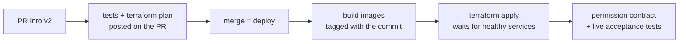

# Deploying v2 (staging) — a first-timer's guide

v2 is MeetLab rebuilt as code: every AWS resource is in Terraform under `infra/v2/`,
and GitHub Actions deploys it. Nobody clicks around the AWS console or runs
`terraform apply` against staging by hand. This page is what you need the first
time you deploy, and the few steps a **person** has to do because the pipeline is
deliberately not allowed to.

- Staging: <https://meet-staging.wwbp.org> (console at `/console`)
- Branch: `v2`. **Never merge v2 work into `main`** — `main` is v1 and is frozen.
- Decisions, costs and known issues: [`infra/v2/LEDGER.md`](https://github.com/wwbp/MeetLab/blob/v2/infra/v2/LEDGER.md)

## How a deploy happens



1. Open a PR into `v2`. CI runs the unit and Terraform tests and posts the
   Terraform plan as a comment. **Read the plan**: anything "destroy" or "replace"
   on the database, bucket or load balancer deserves a second look.
2. **Merging is the deploy.** There is no separate approval button (GitHub's free
   plan has none for private repos).
3. Every merge restarts the services, so a call in progress can drop. **Time
   merges around studies.** Instances also pick up the latest Amazon ECS image on
   replacement; we chose not to pin it.
4. After the apply, the `acceptance` job checks every AWS permission the code uses
   (and ones it must never have), then runs real meetings against staging: a bot
   joins, is stopped several ways, is killed, and recordings land in S3. A red
   acceptance job means the deploy is live but broken — look at it before the
   next merge.

Watch it under **Actions → Infra v2** on GitHub.

## Things only a person does

**Log every one of these** in the "Manual actions" table in
[`infra/v2/LEDGER.md`](https://github.com/wwbp/MeetLab/blob/v2/infra/v2/LEDGER.md):
when, who, what, why. Never the secret itself.

The pipeline's roles can't change their own permissions, can't read v1, and
can't create access keys. That's on purpose; these steps are the price.

### 1. Bootstrap (once, and whenever CI needs new permissions)

`infra/v2/bootstrap/` holds the CI roles and the permissions boundary. It is
applied from a laptop by someone with admin rights in the AWS account:

```bash
cd infra/v2/bootstrap
terraform init
terraform plan     # read it: only meetlab-v2-* roles and policies should change
terraform apply
```

When a PR changes `bootstrap/`, apply it **before** merging that PR, or the
pipeline will fail with "AccessDenied".

### 2. Secrets (once per environment)

Vendor keys live in SSM Parameter Store under `/meetlab-v2/staging/`. They are
never in Terraform or in the repo. To fill them (copies v1's keys, generates the
rest, prints no values):

```bash
infra/v2/seed-staging-secrets.sh
```

Staging uses v1's vendor keys for sanity checks only — **no load tests** on them
(see "On hold" in the ledger).

### 3. The video-recording key for LiveKit

LiveKit Cloud records the room on *its* servers and uploads the mp4 to our bucket,
so it needs an AWS access key. Terraform creates a user for this,
`meetlab-v2-staging-egress-writer`, that can **only add files under
`recordings/`** — it can't read, list or delete anything. Terraform does **not**
create its key (a key in Terraform would sit in the state file). You mint it:

```bash
# once the egress user exists (after the PR that adds it is applied)
aws iam create-access-key --user-name meetlab-v2-staging-egress-writer \
  --query 'AccessKey.[AccessKeyId,SecretAccessKey]' --output text \
| { read -r id secret
    aws ssm put-parameter --name /meetlab-v2/staging/EGRESS_S3_KEY_ID     --type SecureString --overwrite --value "$id"
    aws ssm put-parameter --name /meetlab-v2/staging/EGRESS_S3_KEY_SECRET --type SecureString --overwrite --value "$secret"; }
```

The key goes straight into SSM and is never shown. agent-runner hands it to
LiveKit with each recording request, so there is nothing to paste into LiveKit's
dashboard.

!!! warning "Order matters"
    agent-runner won't start if those two parameters are missing (ECS can't
    fetch the secret). Before the very first deploy that needs them, put
    placeholder values in, deploy, mint the real key, then force a new
    deployment of agent-runner (or just merge the next PR).

**Rotating the key:** create a second key (a user may have two), write it to SSM
with the command above, redeploy agent-runner, then delete the old key with
`aws iam delete-access-key`.

### 4. The NVIDIA key for staging's speech-to-text server (once)

Staging can run its own Parakeet speech-to-text server (the "NIM", on a GPU), as v1
does. NVIDIA's registry needs a key both to download the server and its model. It
lives in Secrets Manager, in the shape ECS expects for a private registry:

```bash
# copies v1's key; nothing is printed
aws secretsmanager create-secret --region us-east-1 --name meetlab-v2/staging/ngc \
  --secret-string "$(aws ssm get-parameter --region us-east-1 --name /meetlab/stt-nim/ngc_api_key \
      --with-decryption --query Parameter.Value --output text \
    | python3 -c 'import json,sys; print(json.dumps({"username": "$oauthtoken", "password": sys.stdin.read().strip()}))')"
```

Only needed before the NIM is first switched on. Staging/test use is covered by
NVIDIA's free developer program; production needs a licence (ledger).

## Switching staging's speech-to-text server on and off

Off by default: bots use Deepgram and the GPU costs nothing. To turn it on, open a PR
that sets `default = true` on `stt_nim_enabled` in `infra/v2/staging/variables.tf`,
and merge it (merge = deploy). What happens:

- An on-demand `g6.xlarge` starts, downloads the server and **builds the model: about
  20–30 minutes** before it answers. Bots started meanwhile still point at it and
  their speech is not transcribed, so wait.
- The `transcript` live test waits for it, then checks a bot's transcript came from it.
- Turn it off again with a PR setting `default = false`. It costs $0.805 per hour
  while on (on-demand; spot was tried and AWS had none) plus a small load balancer,
  so an hour-long test costs under $1. **Don't leave it on.**

`g6.xlarge` is the smallest machine that can run it: the model needs 13.75 GB of GPU
memory, and the fractional-GPU machines top out at 11.4 GB (ledger).

## Switching our own LLM and voice on and off

Same idea, for the language model (Qwen, on vLLM) and the voice (Kokoro): set
`default = ["llm", "tts"]` on `model_services` in `infra/v2/staging/variables.tf` (or
just one of them) and merge. Each starts its own `g6.xlarge` ($0.805/hour) and
downloads its model first (minutes). Then, in the console's Bot Config, a room uses
them by choosing `Qwen/Qwen2.5-7B-Instruct` as its model and `kokoro` as its voice
provider (voice names like `alloy` work). The `our_models` live test waits for both,
then checks a bot answers and speaks on them. Turn them off with `default = []`.

## Running the live tests yourself

The same tests CI runs, from your laptop:

```bash
CONSOLE_PASSWORD=... LIVEKIT_URL=... LIVEKIT_API_KEY=... LIVEKIT_API_SECRET=... \
caffeinate -i uv run --no-project --with livekit --with livekit-api --with boto3 \
  python agent-runner/tests/acceptance_staging.py video_recording
```

Leave out the scenario name to run all of them. Offline infra tests:
`make test-infra`.

## Gotchas we've hit

| Symptom | Cause | What to do |
|---|---|---|
| Live tests time out at random from a laptop | The Mac slept; signatures and sockets expired | `caffeinate -i`, or rely on the CI acceptance job |
| `pnpm test:api` fails tests with 429 | Start-link rate limit, 5 per minute | Wait a minute between runs |
| Local `make start` can't bind port 3000 | Another app holds it | Stop the other app, then `docker compose ... up -d --force-recreate meet` |
| Local tests pass/fail on code you already changed | Dev containers serve stale mounts | Restart the container before trusting a result |
| Bot joins but never speaks, no errors | ElevenLabs quota used up | Check the ElevenLabs subscription before blaming the deploy |
| Pipeline "AccessDenied" right after a merge | The PR needed bootstrap permissions that weren't applied yet | Apply bootstrap (step 1), re-run the job |
| Bot containers left running locally | A bot alone in a room waits 15 min for someone to arrive (`BOT_ARRIVAL_GRACE_SECONDS`) | `make down` cleans them up sooner |
| Bot machines never go away; console says a machine "is stuck shutting down" | Someone stopped or terminated an ECS machine by hand. ECS can't finish draining a stopped machine, so Auto Scaling waits forever and the pool can't shrink (2026-10-02: 27 h, two idle machines) | **Never stop or terminate ECS machines by hand**; scale through the console or Terraform. To unstick: `aws autoscaling complete-lifecycle-action --auto-scaling-group-name meetlab-v2-staging-bots --lifecycle-hook-name ecs-managed-draining-termination-hook --instance-id <id> --lifecycle-action-result CONTINUE`, then log it under Manual actions |
