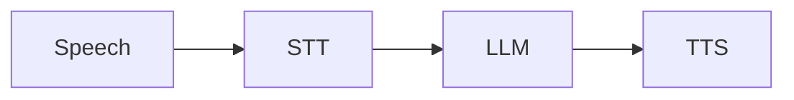

# Writing diagrams and math

Use Mermaid for architecture and runtime flows, SVG for scalable exported
figures, and PNG for screenshots or raster plots. MathJax renders LaTeX math as
SVG. These work in the documentation site; an editor's Markdown preview may
need its own Mermaid or math extension.

## Mermaid

Write a fenced `mermaid` block in any page:

````markdown

````


Flowcharts, sequence diagrams, and entity relationship diagrams are used in
the [architecture guide](architecture.md). Label relationships with what crosses
the boundary and link the surrounding text to the implementation.

## SVG and PNG

Put figures in `docs/assets/` and use a relative image link with descriptive alt
text. For pages in a subdirectory, adjust the path accordingly.

```markdown

```


PNG uses the same syntax: ``. Add the file
before linking it. SVG preserves sharp text when zoomed or printed; PNG is useful
for screenshots. Commit the editable source beside an exported figure when one
exists. Link important images to their original file for downloading.

Download the example as [SVG](assets/voice-turn.svg) or [PNG](assets/voice-turn.png).

## LaTeX math

Use `$...$` inline and `$$` on separate lines for a display equation. For example,
define response latency as $T_{\mathrm{response}}$ and show a simplified model:

```latex
$$
T_{\mathrm{response}} \approx
T_{\mathrm{endpointing}} + T_{\mathrm{STT}} +
T_{\mathrm{LLM,first}} + T_{\mathrm{TTS,first}} + T_{\mathrm{transport}}
$$
```

$$
T_{\mathrm{response}} \approx
T_{\mathrm{endpointing}} + T_{\mathrm{STT}} +
T_{\mathrm{LLM,first}} + T_{\mathrm{TTS,first}} + T_{\mathrm{transport}}
$$

This is a teaching approximation, not the definition of a measured metric:
streaming stages overlap. Use the actual timestamp definitions in the
[latency experiments](latency-experiments.md) when interpreting results.

## Full LaTeX / TikZ figures

MathJax handles mathematical notation; it does **not** compile arbitrary LaTeX
documents or TikZ drawings. Compile those with your LaTeX toolchain, export the
figure as SVG or PNG, and embed it using the image syntax above. Keep the `.tex`
source beside the export. No TeX installation is needed to build this site.

## Build and rendering checks

Run `make docs-build` before sharing a change. It validates the documentation
build; Mermaid and MathJax render in the browser, so also open the changed page
with `make docs` and inspect the figure. The JavaScript renderers load from CDNs
and require network access; local SVG and PNG figures do not.

The setup follows Material's official
[diagram](https://squidfunk.github.io/mkdocs-material/reference/diagrams/),
[image](https://squidfunk.github.io/mkdocs-material/reference/images/), and
[math](https://squidfunk.github.io/mkdocs-material/reference/math/) integrations.
